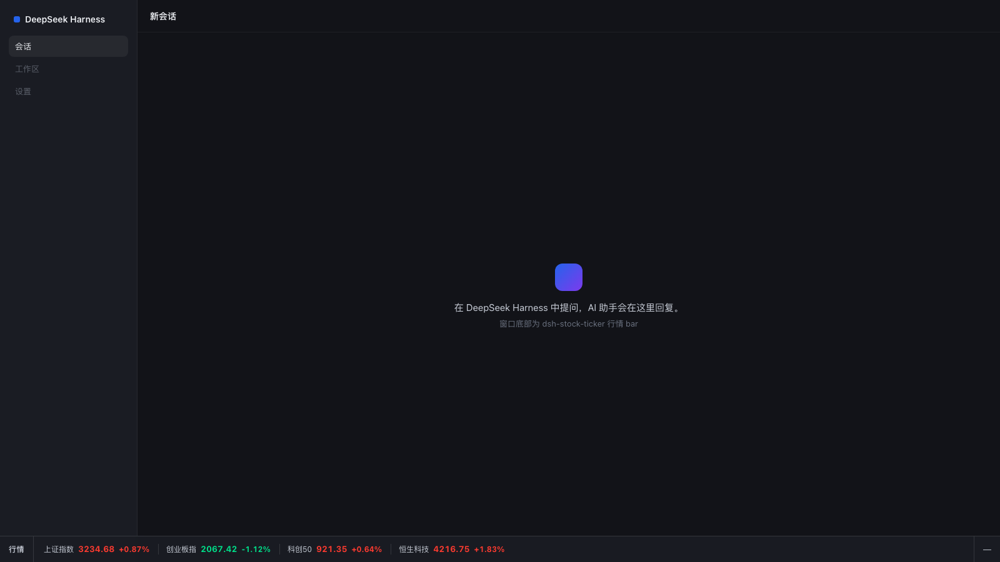

# 🧩 dsh-stock-ticker

> DeepSeek Harness 的一个悬浮行情插件：在页面右上角显示一个可拖拽、可收起的半透明小窗，实时展示 A 股与港股核心指数。

<p align="center">
  <a href="./LICENSE"></a>
  
</p>

## 📸 预览

<p align="center">
  
</p>

## ✨ 功能

- 悬浮窗口，**可拖拽**、**可收起**
- 背景跟随 DeepSeek Harness 主题色（80% 透明度），红涨绿跌、锐利配色
- 每 5 秒自动刷新
- 每个指数只显示两项：**当前点位 + 涨跌幅**

显示的指数：

| 指数 | 代码 |
| --- | --- |
| 上证指数 | 000001 |
| 创业板指 | 399006 |
| 科创50 | 000688 |
| 恒生科技 | HSTECH |

## 🚀 快速开始（动态插件）

这是当前验证可用的安装方式：作为一个 **DeepSeek Harness 动态 Cordis 插件**载入。

1. 打开 DSH，让 agent 用动态插件工具创建插件（`cordis_define`）：

   - `code.host` 填 [`host.js`](./host.js) 的整段内容
   - `code.client` 填 [`client.js`](./client.js) 的整段内容

2. 然后 `cordis_run` 激活。客户端首次运行需要你在审批卡片里点「允许」。

3. 刷新页面后，右上角即出现悬浮行情窗。

> 两个文件里的代码就是 `cordis_define` 的 `code.host` / `code.client` 函数体，直接整段复制即可，无需修改。

## 🗂️ 代码结构

```
dsh-stock-ticker/
├── lib/index.js    # Host 包入口：注册 /dsh-stock-ticker/quotes 路由
├── lib/client.js   # Client bundle：悬浮窗 UI + 5s 轮询
├── host.js         # 动态插件形式的 Host 半区（可选）
├── client.js       # 动态插件形式的 Client 半区（可选）
├── package.json    # 包清单（dsh bundle + client 声明）
├── cordis.patch.yml  # bundle patch：插入插件行
├── assets/screenshot.png  # README 预览截图
├── LICENSE
└── README.md
```

## 🔌 数据源

- 接口：`https://qt.gtimg.cn/q=sh000001,sz399006,sh000688,hkHSTECH`
- 免费、无需鉴权，返回纯文本的 `~` 分隔行
- Host 侧通过 `shell` 服务执行 `curl` 抓取（DSH 默认部署未注册 `web` fetch provider，因此不走 `web.fetch`）

## 📦 持久化安装（常驻）

把插件作为 DSH profile 的一个 bundle 安装，随 DSH 启动自动加载、重启不消失：

1. 把本仓库软链到 profile 的 node_modules：

   ```bash
   ln -sfn /path/to/dsh-stock-ticker "$HOME/.dsh/profiles/node_modules/dsh-stock-ticker"
   ```

2. 在 `$HOME/.dsh/profiles/<profile>/package.json` 的 `dsh.profile.bundles` 数组里加入 `"dsh-stock-ticker"`。
3. 重启 DSH Desktop。

> 结构参照社区 `dsh-plugin` 约定（与 `dsh-skin-cursor` 相同）：Host 入口 `lib/index.js` 注册同源路由 `/dsh-stock-ticker/quotes`（内部用 `shell` + `curl` 抓取腾讯行情），Client bundle `lib/client.js` 渲染悬浮窗并每 5 秒 `fetch` 该路由。

## 📄 License

[MIT](./LICENSE)
